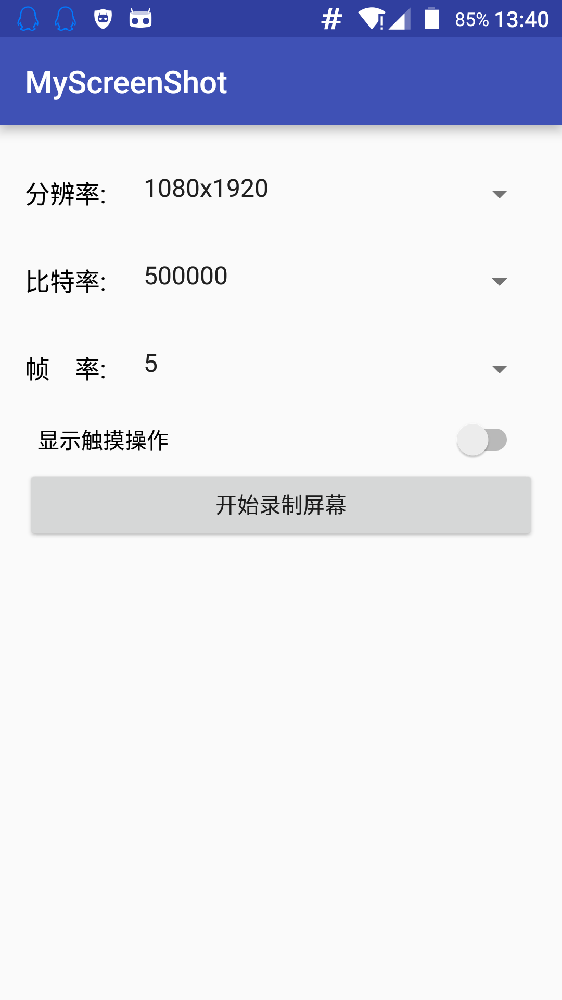

## Android >= 5.0(4.4 root )

## 屏幕录制视频

```java
//in onCreate
mMediaProjectionManager =
                (MediaProjectionManager) getSystemService(MEDIA_PROJECTION_SERVICE);
                
                
//开始截图,这里系统会弹出权限确认窗口
Intent captureIntent = mMediaProjectionManager.createScreenCaptureIntent();
startActivityForResult(captureIntent, REQUEST_CODE);

// 
@Override
protected void onActivityResult(int requestCode, int resultCode, Intent data) {
    if(requestCode == REQUEST_CODE) {
        startShotNow(resultCode, data);
    }
}


mMediaProjection =
        mMediaProjectionManager.getMediaProjection(resultCode, data);

if(mMediaProjection == null) {
    Log.e(TAG, "MediaProjection is null");
    return;
}

mFile = new File(getRandomFileName());

Log.e(TAG, "startShotNow: " + mDpiSizeBean.getHeight() + "  " + mBitRate + "  " + mFps);


mShoter = new MyShoter(mDpiSizeBean.getWidth(), mDpiSizeBean.getHeight(), mBitRate, 1,
        mFps, mMediaProjection, mFile.getAbsolutePath());

new Thread(mShoter).start();
mBtnShotStart.setText("停止录制");

moveTaskToBack(true);

```

## [APK DEMO](my/app.apk)

